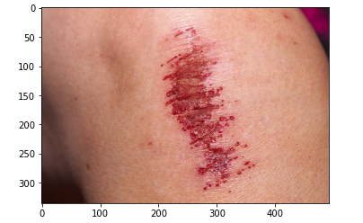

## Infection Detection with Convolutional Neural Network
#### Author: Kevin McDonough 

### Overview
This project analyzes over 1200 images of infected wounds, non-infected wounds and healthy skin. Using these images, as well as image generation techniques such as data augmentation, a convolutional neural network was constructed in order to predict the likelihood of a wound being infected. The model was then deployed on a Steamlit app, allowing users to upload an image at their convenience. 

### Business Problem / Use Case 
The current cost of treating wounds in the U.S. is ~$25 billion per year. Infections represent a large proportion of this, and if an infection is not detected early it can lead to significant economic and human costs. Due to potential barriers to seeing a doctor, such as expensive bills and inability to travel, patients with wounds who are in need of care occasionally put off doctor's appointments. Deploying an image classification app to screen patients would help solve these issues by allowing patients to upload images from the convenience of their home at no cost. The app would then let them know if they need to see a doctor. An additional benefit is that, by screening out patients with a low probability of infection, the app would also save doctors time by allowing them to focus on patients that are truly at risk. Below, I've highlighted some of the advantages of using a CNN for infection detection: 

### Data Understanding 
The dataset consists of over 1200 images. There are two classes: Infection and No Infection. The two classes are roughly equally represented in the overall dataset -- there are around 610 images in each class. The Infection class is made up of wounds with varying degrees of infection. Around 50% of the No Infection class contains images of cuts, scrapes and scabs and the other 50% is images of healthy skin with no wound. This data was collected by scraping google images. Additionally, several images are from the [Medetec Wound Database](http://www.medetec.co.uk/files/medetec-image-databases.html). Below is an example of an image used for each class. 

**Example of Infection:**

**Example of No Infection:**

### Methods
* Data collection using Jupyter, Python and Google Images
* Preprocessing techniques such as data augmentation, rescaling, and performing a train-test split  
* Model building using Keras and Google Colab 
* Model evaluation using seaborn, sklearn and Matplotlib
* Selecting final model and creating predictions for validation data
* Deployment using Heroku and Streamlit. 

The image below gives an overview of the steps taken in the project: 

### Model Creation and Evaluation  

After preprocessing our data, I created an initial CNN model. The model trained on 75% of the images and used the remaining 25% for validation. The initial model only achieved an accuracy of .53 on the validation set. 

#### Best Model 

I realized that more data was necessary, so I used data augmentation to triple the training set to ~2500 images by performing rotations and shifts. Due to computational complexity, I used google Colab for the next model. I also added a layer, decreased batch size and increased the number of epochs to 50. The chart below shows the training and validation accuracy for the resulting model: 

Below is the confusion matrix for the epoch that had the best weights 

The validation accuracy has increased from .53 to ~.905. Additionally, the false negative rate (instances in which an infection is classified as not infected) dropped to ~4%. 

#### Model Ouput on Example Images

I fed the image below into the model and it predicted infection with 98% confidence and no infection with 2% confidence. Apologies for the unsettling image.

I then used LIME (Local Interpretable Model-agnostic Explanations) to identify the parts of the image that caused it to make the prediction it did. LIME essentially creates mini-images within the original image which it feeds into the model. It then allows you to evaluate the areas of the image that the model was keying in on, and block out the areas that were not as important. Below is an example of the output I got on the infected hand image after using this technique. 

This shows that the model is identifying the correct area within in the image and provides confidence that it is performing correctly. 

### Web App

I built a web app hosted on Streamlit sharing which houses the model. Unfortunately the model I used was too large to upload to Github, so this is a slimmed down version of the model with a bit less accuracy. The repository for the app can be found [Here](https://github.com/KPMcDonough49/streamlit_share). The link to the web app can be found here: [Web App](https://share.streamlit.io/kpmcdonough49/streamlit_share/main/app.py)

### Conclusions 

A CNN can be a valuable tool used in infection detection. With a small dataset, the CNN achieved ~90% accuracy and only a 4% false negative rate on the validation set. Further steps would need to be carried out before implementing a CNN within a patient portal; however, a tool such as this would have the potential to save patients money and time, free up doctors' schedules by only having them see patients at risk, and allow patients who would otherwise put off Dr.'s appointemnts catch infection early from the convenience of their homes. 

### Next Steps

**Gather More Data:** Partner with providers to obtain larger dataset with medically reviewed labels.

**Add Classes:** Create more nuanced classes for infection types and healing stages.

**Tweak Model:** Continue to tune parameters with an eye on minimizing false negatives.

**Launch App:** Embed within patient portals such as MyChart so Dr. receives alert and uploaded images, and patient is prompted to schedule an appointment if the classification is Infection. 

### For More Information:
Please review my full analysis in my [Images](./Images), my [Presentation](Capstone_presentation.pdf)   
and my [Streamlit Code](./Streamlit.py). 

For any additional questions, please contact me here:

Email: kpmcdonough@gmail.com.   
Github: https://github.com/KPMcDonough49.   
Linkedin: https://www.linkedin.com/in/kevin-mcdonough-01466a178/.   
